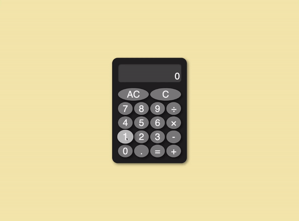

# Calculator
> An on-screen calculator with basic arithmetic operations built using HTML, CSS, and vanilla JavaScript. Live demo [here](https://yamakenth.github.io/calculator/).
## Screen Capture

## Features
- Supports basic math operations (add, subtract, multiply, divide)
- Performs pair-wise calculation from left to right 
- Disregards PEMDAS order of operation when expressions are chained (e.g. 12 + 7 - 5 * 3 = 42)
- Accepts user input via on-screen button clicks (keyboard inputs not yet supported)
- Clears all data on display with "AC" and clears one digit from current input with "C"
- Provides input feedback via animation and change of color on button hover
## Technologies Used
- HTML
- CSS
- JavaScript